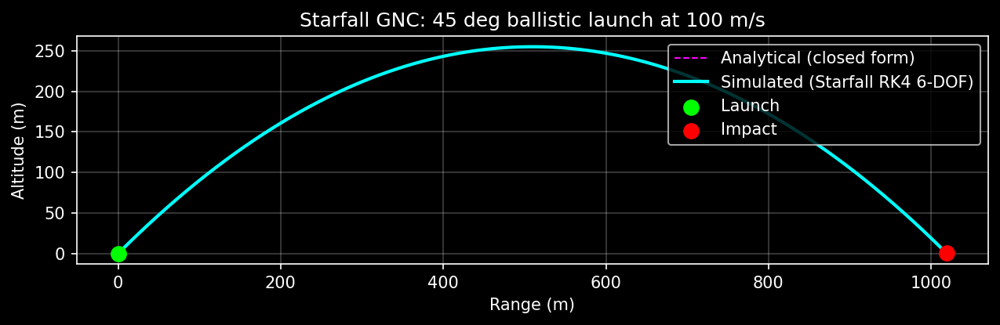
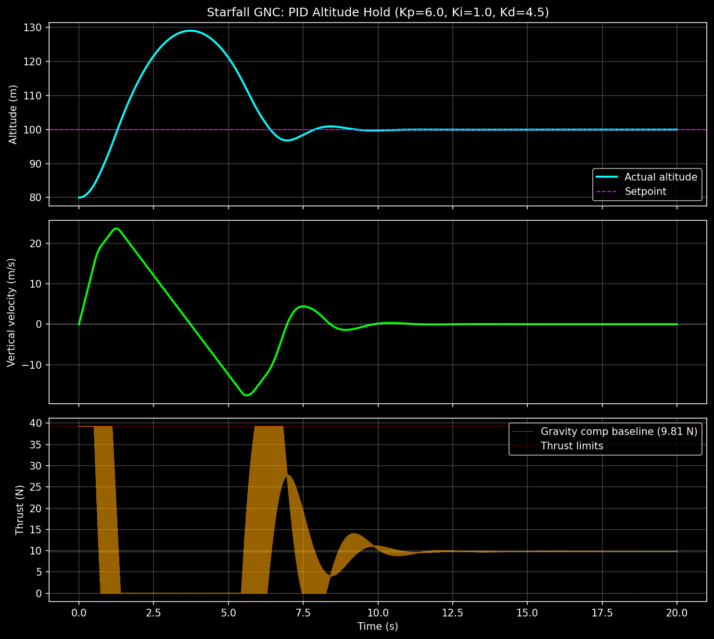
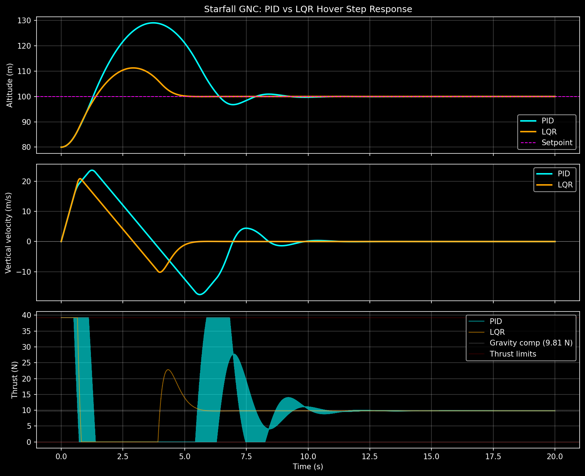

# Starfall GNC

> A 6-DOF guidance, navigation, and control simulator for reusable launch vehicles, built from first principles.

## Goal

Build a complete simulation of a Falcon 9-class booster executing a powered descent and landing, including:

- Full 6-degree-of-freedom rigid body dynamics with quaternion attitude
- Atmospheric and gravitational models
- Sequential controller design: PID → LQR → convex optimization (lossless convexification)
- Extended Kalman Filter for state estimation from realistic IMU/GPS measurements
- Monte Carlo dispersion analysis for terminal landing accuracy

## Roadmap

| Phase | Topic | Status |
|-------|-------|--------|
| 1 | 6-DOF Rigid Body Dynamics |  In Progress |
| 2 | Control (PID → LQR → Convex Guidance) |  Planned |
| 3 | Navigation (EKF with IMU + GPS) |  Planned |
| 4 | Monte Carlo & Documentation |  Planned |

## About

Built by [Alisha Hunnewell](https://github.com/alishahunnewell), recent graduate at the University of Florida in Astronomy, as part of preparing for graduate study in space systems engineering and a career in launch vehicle GNC.

## Results

### Phase 1: Dynamics Validation

The 6-DOF rigid body dynamics core has been validated end-to-end against
the classical ballistic solution. A 1 kg projectile launched at 45° with
100 m/s in uniform gravity, propagated through the full
`rigid_body_derivative` → RK4 pipeline, matches the closed-form analytical
trajectory to within numerical precision.

| Quantity | Simulated | Analytical | Error |
|----------|-----------|------------|-------|
| Range (m) | 1018.94 | 1019.37 | 0.042% |
| Apex altitude (m) | 254.84 | 254.84 | 0.000% |
| Flight time (s) | 14.41 | 14.42 | 0.042% |

The remaining error is dominated by impact-time discretization at dt = 10 ms.
Apex altitude matches analytically to the printed precision.

### Phase 2A: PID Altitude Hold

A PID controller drives a 1 kg vehicle from 80 m initial altitude up to a
100 m hover setpoint, with thrust saturation at 4× weight. The controller
saturates against the upper thrust limit during the initial climb,
overshoots ~29 m, then settles to within 1.2 cm of the setpoint under
conditional anti-windup.

| Quantity | Value |
|----------|-------|
| Steady-state altitude error | 0.012 m |
| Steady-state velocity error | 0.002 m/s |
| Peak overshoot | 29.1 m |
| Settling time (to ±0.5 m) | ~10 s |
| Gains | Kp=6, Ki=1, Kd=4.5 |

### Phase 2B: LQR Optimal Control

LQR (Linear Quadratic Regulator) optimal feedback gains are derived by
solving the continuous algebraic Riccati equation around the hover
equilibrium. The same 80 m → 100 m hover problem is rerun, this time
using LQR-derived gains instead of hand-tuned PID gains. The LQR
controller outperforms PID across every metric.

| Quantity | PID | LQR |
|----------|-----|-----|
| Steady-state altitude error | 0.012 m | 0.000 m |
| Peak overshoot | 29.1 m | 11.3 m |
| Max abs error | 29.1 m | 20.0 m |
| Final velocity | 0.002 m/s | 0.000 m/s |

LQR achieves ~2.6× less overshoot, no steady-state error, and a smoother
control signal, all derived from a quadratic cost J = ∫(x'Qx + u'Ru)dt
with Q = diag(10, 1), R = 0.1 against the linearized hover dynamics.

## References

- Wie, *Space Vehicle Dynamics and Control*
- Markley & Crassidis, *Fundamentals of Spacecraft Attitude Determination and Control*
- Açıkmeşe & Ploen (2007), "Convex Programming Approach to Powered Descent Guidance for Mars Landing"
- Blackmore (2013), "Lossless Convexification of Optimal Control Problems"
